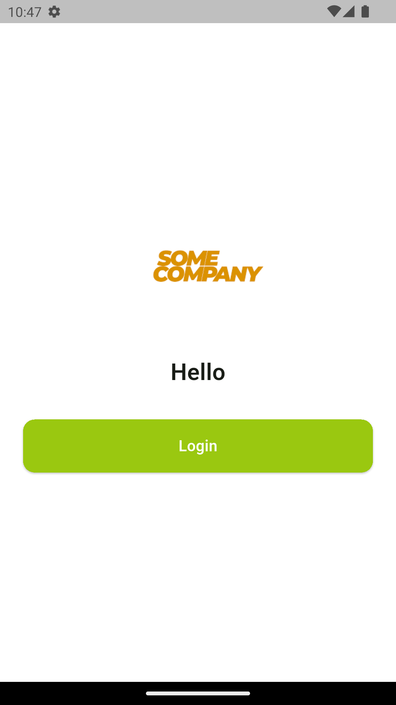
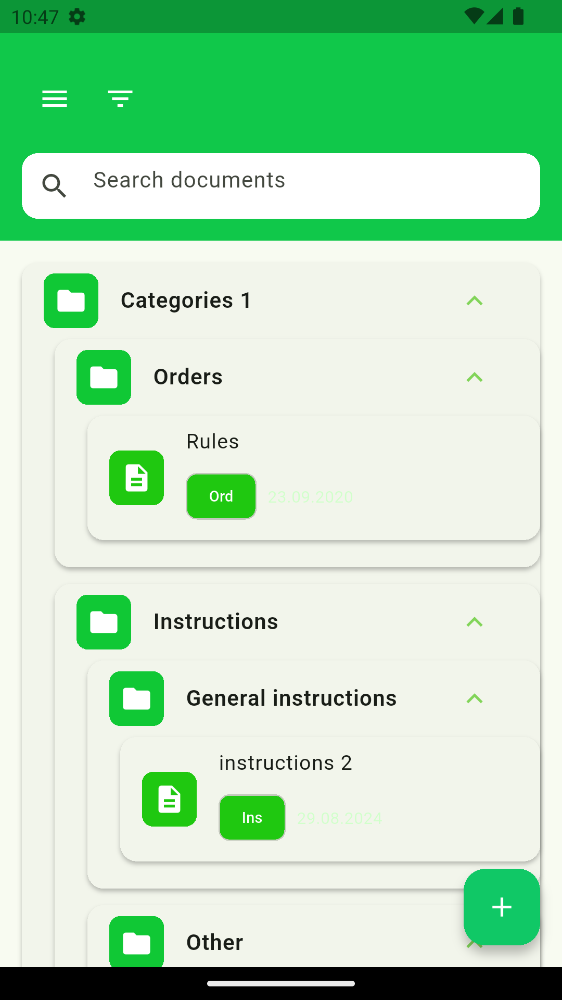
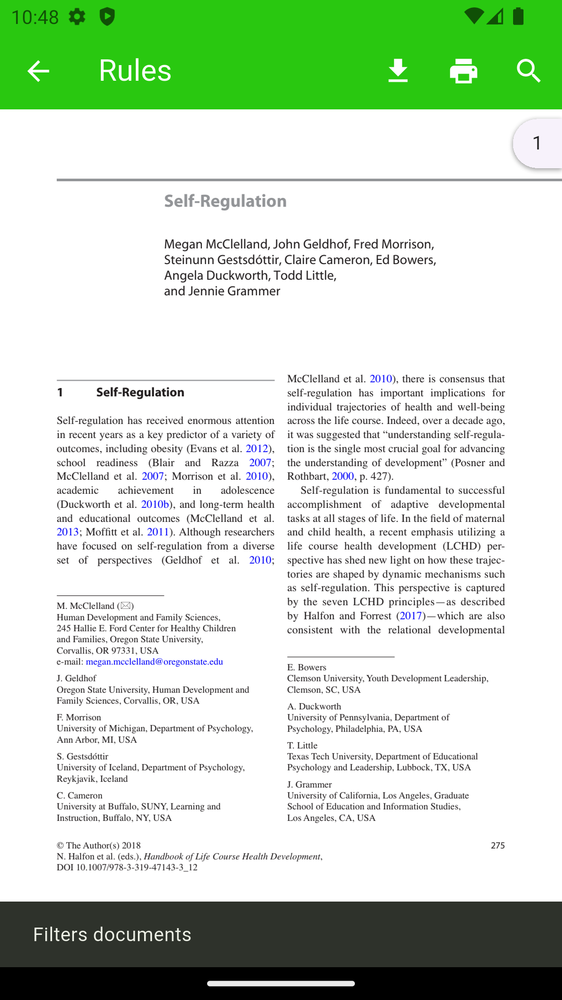
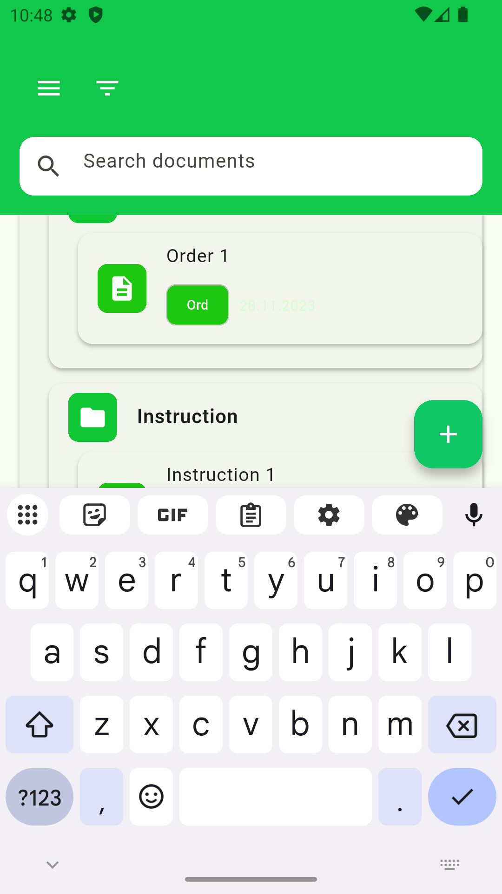
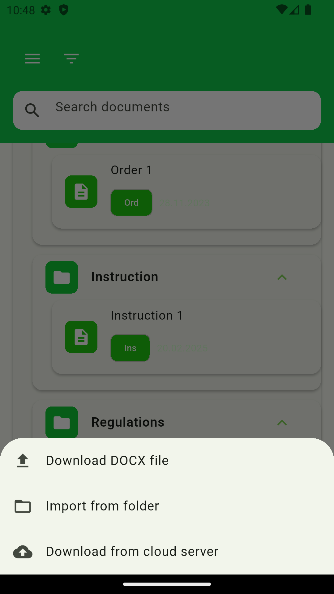
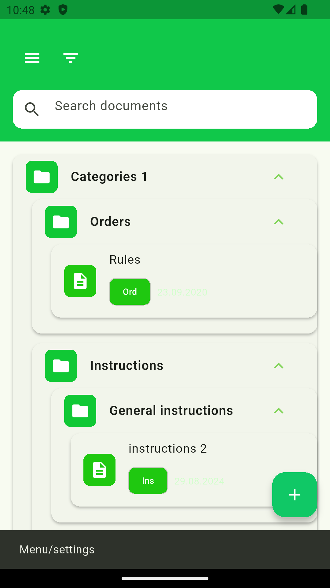

## Сборка и запуск
### Требования
Flutter (последняя стабильная версия) — [инструкция по установке](https://docs.flutter.dev/install)

Android Studio / VS Code (с плагинами Flutter и Dart)
Для Android: Android SDK

## Шаг 1. Клонирование репозитория
bash
git clone https://github.com/Perfectblue1710/my-app-flutter.git
cd my-app-flutter
## Шаг 2. Установка зависимостей
bash
flutter pub get
## Шаг 3. Запуск (отладка)
Подключите устройство (эмулятор или реальный телефон) и выполните:
bash
flutter run
## Шаг 4. Сборка установочного файла
Платформа	Команда	Результат
Android (APK)	flutter build apk	build/app/outputs/flutter-apk/app-release.apk
Android (AAB для Google Play)	flutter build appbundle	build/app/outputs/bundle/release/app-release.aab
iOS (только macOS)	flutter build ios	/build/ios/iphoneos/Runner.app
Web	flutter build web	Папка build/web/
## Шаг 5. Очистка проекта
Если возникли проблемы с кэшем:
bash
flutter clean
flutter pub get
flutter run

## 📱 Screenshots

| Главный экран | Список документов | Просмотр документа | Меню | Поиск | Дополнительно |
|-------------------|----------------------|-----------------------|
|  |  |  | [Меню](screenshots/screen_menu.png) |  | 

## О конфиденциальности
Исходное приложение работало с реальными документами компании. В данном репозитории представлена демо-версия с фейковыми (заглушечными) файлами и анонимизированными данными. Архитектура, логика и UI сохранены полностью.

---

## Build & Run

### Prerequisites
- Flutter (latest stable version) — [installation guide](https://docs.flutter.dev/get-started/install)
- Android Studio / VS Code with Flutter & Dart plugins
- For Android: Android SDK

### Step 1. Clone the repository
```bash
git clone https://github.com/Perfectblue1710/my-app-flutter.git
cd my-app-flutter
```

### Step 2. Install dependencies
```bash
flutter pub get
```

### Step 3. Run (debug mode)
Connect a device (emulator or real phone) and run:
```bash
flutter run
```

### Step 4. Build release version

| Platform | Command | Output location |
|----------|---------|-----------------|
| **Android (APK)** | `flutter build apk` | `build/app/outputs/flutter-apk/app-release.apk` |
| **Android (AAB for Google Play)** | `flutter build appbundle` | `build/app/outputs/bundle/release/app-release.aab` |

### Step 5. (Optional) Clean project
If you encounter cache issues:
```bash
flutter clean
flutter pub get
flutter run
```
## 📱 Screenshots

| Login Screen | Documents List | PDF Viewer | Menu | Search | More |
|--------------|----------------|------------|------|--------|------|
|  |  |  |  |  |  |

---

## 🔒 Confidentiality Note

> The original application worked with real company documents. **This repository contains a demo version** with mock/fake files and anonymized data. The architecture, logic, and UI are fully preserved.

